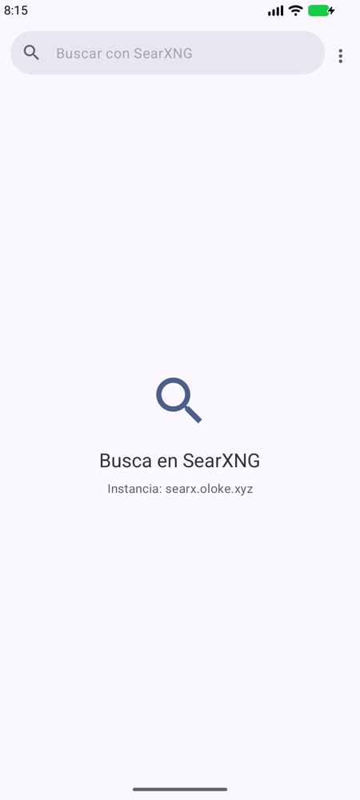
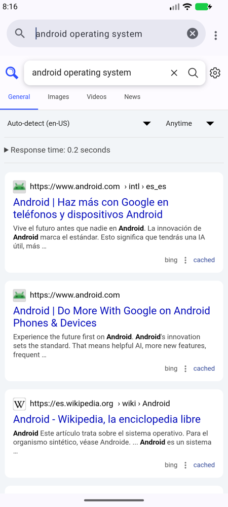
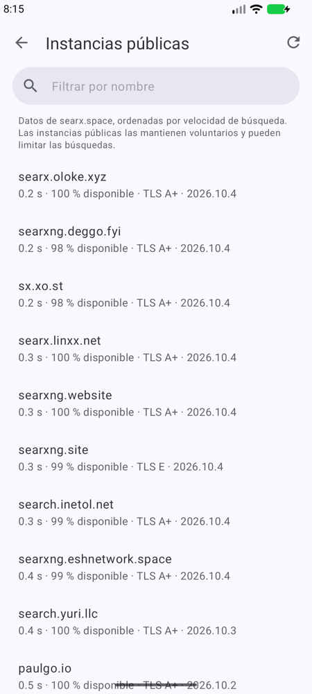
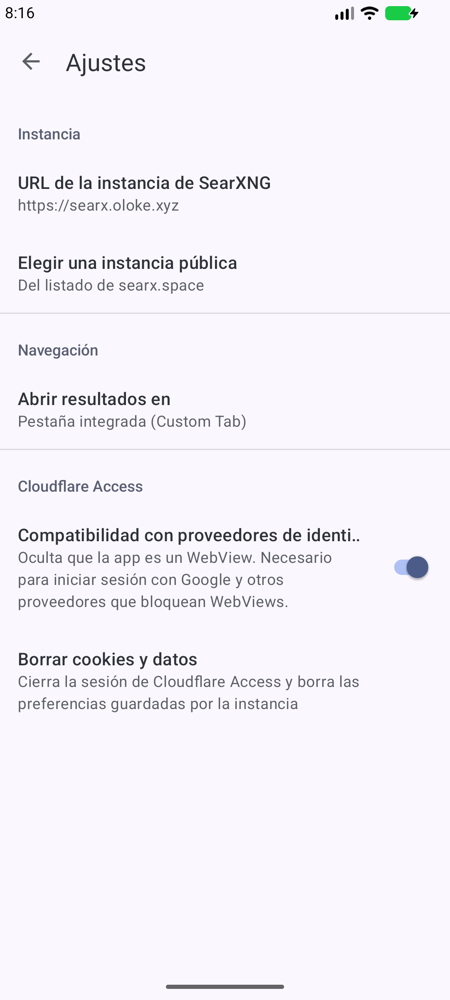
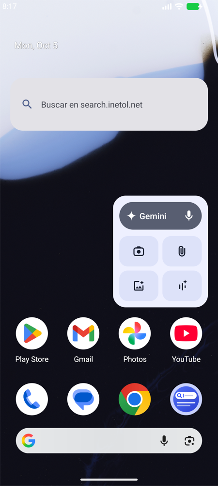

# SearxBar

Aplicación Android sencilla para buscar en tu instancia de [SearXNG](https://github.com/searxng/searxng),
con diseño Material 3, widget para la pantalla de inicio y soporte para instancias protegidas con
[Cloudflare Access](https://developers.cloudflare.com/cloudflare-one/applications/).

<p align="center">
  
  
  
  
  
</p>

## Características

- **Tu instancia, tus reglas**: introduce la URL de cualquier instancia de SearXNG (también `http://` en red local).
- **Instancias públicas**: elige una del listado de [searx.space](https://searx.space), ordenadas por velocidad,
  con disponibilidad, nota TLS y versión.
- **Cloudflare Access**: si la instancia está protegida, la app te lleva al login de Access (y al proveedor de
  identidad: Google, GitHub, Okta, PIN por correo…) y, al terminar, vuelve a la búsqueda que estabas haciendo.
- **Widget** de barra de búsqueda (4×1, redimensionable) con colores Material You.
- **Material 3** con colores dinámicos (Android 12+) y modo oscuro.
- Los resultados se abren en una pestaña integrada (Custom Tab), en el navegador o dentro de la app.
- **Sugerencias mientras escribes**, a través de la propia instancia (DuckDuckGo por defecto; también Google, Qwant
  o el proveedor configurado en la instancia). Funcionan también con Cloudflare Access.
- **Mantén pulsado un enlace** para abrirlo en el navegador predeterminado, copiarlo o compartirlo.
- Integración con el sistema: *Compartir → SearxBar*, *Buscar con SearxBar* al seleccionar texto y búsquedas web (`WEB_SEARCH`).

## Instalación

[](https://apps.obtainium.imranr.dev/redirect?r=obtainium://add/https://github.com/ilismal/searxbar)

Con [Obtainium](https://github.com/ImranR98/Obtainium) recibirás las actualizaciones directamente desde las
releases de GitHub. También puedes descargar el APK desde la [última release](../../releases/latest) e instalarlo
a mano (tendrás que permitir la instalación de orígenes desconocidos). Requiere **Android 8.0** o superior.

## Uso

1. Abre la app y pulsa **Introducir URL** (o **Elegir de searx.space** para usar una instancia pública).
2. Escribe en la barra de búsqueda y pulsa la tecla de buscar.
3. Opcional: mantén pulsada la pantalla de inicio → **Widgets** → **SearxBar** para añadir la barra de búsqueda.

El menú ⋮ permite recargar, compartir el enlace, abrir la página en el navegador, ir a la página principal de la
instancia y cerrar la sesión de Cloudflare Access.

### Cloudflare Access

Cuando la sesión de Access no existe o ha caducado, Cloudflare redirige a
`https://<equipo>.cloudflareaccess.com/…`. SearxBar sigue esa redirección **dentro de la app**, igual que las
páginas del proveedor de identidad mientras dura el login; al completar la autenticación, Access fija la cookie
`CF_Authorization` y te devuelve a la búsqueda original. El resto de enlaces externos se abren fuera.

- Si el servidor responde **401/403**, aparece un aviso con **Iniciar sesión**, que borra la cookie de Access
  y fuerza un nuevo login.
- **Ajustes → Compatibilidad con proveedores de identidad** (activada por defecto) oculta el marcador WebView del
  *user agent*. Google, entre otros, bloquea el inicio de sesión OAuth dentro de WebViews.
- **Ajustes → Borrar cookies y datos** elimina toda la sesión y las preferencias guardadas por la instancia.

## Compilar

Requisitos: Android Studio (o JDK 17–22 + Android SDK 35).

```sh
./gradlew assembleDebug
# APK en app/build/outputs/apk/debug/app-debug.apk
```

> Gradle 8.9 no funciona con Java 23 o superior. Si Android Studio avisa de que la versión de la JVM es
> incompatible, ve a *Settings → Build Tools → Gradle → Gradle JDK* y elige un JDK 21.

### Release firmada

Crea un `keystore.properties` en la raíz del proyecto (está en `.gitignore`):

```properties
storeFile=/ruta/a/tu-clave.jks
storePassword=…
keyAlias=…
keyPassword=…
```

y ejecuta `./gradlew assembleRelease`. Sin ese fichero, el APK de release se genera sin firmar.

## Estructura

```
app/src/main/java/app/searxbar/
├── MainActivity.kt           # Barra de búsqueda + WebView, navegación y Cloudflare Access
├── CloudflareAccess.kt       # Detección de URLs de Access, logout y borrado de sesión
├── SettingsActivity.kt       # Ajustes (instancia, enlaces, compatibilidad, borrar datos)
├── InstancePickerActivity.kt # Selector de instancias públicas
├── Suggestions.kt            # Sugerencias vía /autocompleter de la instancia
├── SuggestionAdapter.kt      # Desplegable de sugerencias
├── SearxSpace.kt             # Descarga y filtrado del listado de searx.space
├── SearchWidgetProvider.kt   # Widget de pantalla de inicio
├── Prefs.kt                  # Preferencias y normalización de URLs
└── SearxBarApp.kt            # Colores dinámicos y valores por defecto
```

## Licencia

[WTFPL](LICENSE): haz lo que te dé la gana.
